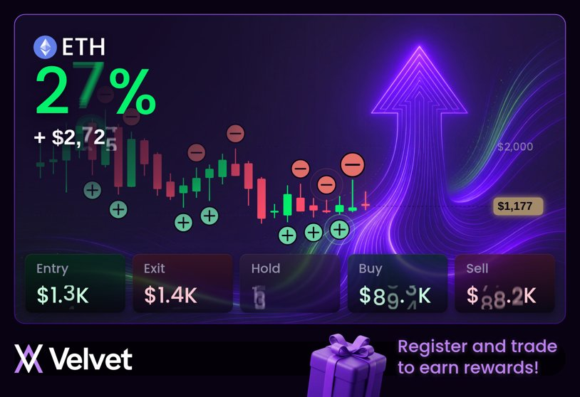

# Velvet · Dynamic PNL card

An animated, shareable PNL card for Velvet Capital. Candles appear left → right on real token prices. Simulated trades are marked on the chart, and realized PNL counts up. The card can be exported as a video (MP4 or WebM).

**Open `velvet-pnl-card.html` in Chrome.** It is a single self-contained file: the images are inlined, and fonts load from Google Fonts. It fetches live prices from Binance in the browser.

---

## Files

| File | What it is |
|---|---|
| `src.html` | **The source.** HTML + CSS + JS in one file. Image slots are placeholders: `{{BG}}`, `{{GIFT}}`, `{{LOGO}}`, `{{ETH}}`. |
| `build.py` | Inlines the four images as base64 data URIs into `src.html` and writes `velvet-pnl-card.html`. Run it with `python3 build.py`. |
| `velvet-pnl-card.html` | Built output. **Do not edit by hand**: edit `src.html`, then rebuild. |
| `bg.jpg` | Card background with the neon arrow. Exported from Figma, without text. |
| `gift.png`, `logo.png`, `eth.png` | Footer gift, the Velvet wordmark, and the ETH token icon. Exported from Figma. |
| `test-*.mjs` | Playwright helpers. Run them with `node <file>` from a folder where `playwright` is resolvable. They render frames at given times (`s_*.png`, `r*.png`) and check that settings persist across reload. |
| `preview.jpg` | Screenshot. |

Workflow: edit `src.html` → `python3 build.py` → open or test `velvet-pnl-card.html`.

## Design source (Figma)

The file is `BS-Velvet-UI`, key `1YQL9NmfrMKQXljQwTcFyF`.

- Card frame: node `15795:60133` ("Frame 17", 1628×1116). Card body: `15791:59990` ("Without chart", 1548×870, radius 30).
- Card border: a 1px linear gradient, `#9D58F4` (top) → `#460B91` (bottom).
- Gradient between the chart and the numbers: node `15801:167563`, a radial gradient `rgba(20,11,40,1)` → `rgba(31,20,59,0)`. Its transform is in `drawHeaderGradient()`.
- Stat tiles: nodes `15791:59993…60005`. Fill is black at 62%. Figma GLASS effect: frost 3, refraction 0.36, depth 39, light angle 345°, intensity 0.8, dispersion 0.26.
- Trade markers: `marker/buy` and `marker/sell` from node `15938:33625`. A 16px circle, `#6ED2A7` / `#E46F6B`, with a 1px `#090213` stroke and a plus/minus icon.
- Typography: Poppins Medium for the big %, ETH, tile labels and values. Inter SemiBold for the `+ $` line and the price pill.

## Architecture (src.html)

The whole card is drawn on **one `<canvas>` of 1628×1116**, in Figma coordinates. That is what makes video export possible through `canvas.captureStream()`.

**Rendering is a pure function of time, `render(t)`.** There is no per-frame state, so scrubbing, looping and export are deterministic. Every "smooth" effect is a closed-form function of `t`:

- `lagAt()` / `lagged()` is a first-order exponential lag over a list of step events. Each step adds `Δ·(1−e^{−(t−tᵢ)/τ})`.
- `smoothSeries()` does Catmull-Rom interpolation (kept as a helper).

### Main sections, in code order

1. **constants**: `CARD`, `CHART` (the plot area; a right gutter of about 190px holds the price labels), and `TOKENS`. `TL` holds the timeline presets:
   - `30D` uses 5m base candles.
   - `1Y` uses 1h base candles.
   - `5Y` uses 1d base candles.
2. **data**:
   - `loadBase()` tries Binance (`api.binance.com`, then `data-api.binance.vision`), then CryptoCompare. If all of them fail, it falls back to `demoData()` (seeded GBM, labelled "Demo data" in the top-right corner).
   - `aggregate()` builds N on-screen candles from the base candles using real OHLC rules: open of the first, close of the last, max high, min low.
3. **strategy**:
   - `buildHistory()` runs a zigzag pivot search over the **whole** loaded timeline. It stands in for the user's real trade history: L means buy, H means sell. The density comes from the debug slider "Trades in history".
   - `buildModel(candles)` takes the pivots inside the selected period and maps them to candle indices. It then simulates fills: 60% on the pivot candle, the rest on the next candle. It also builds per-candle portfolio state, the tile stat events, and the timeline.
   - Timeline: `T = D − tail` is the reveal time, and `slot = T/N`. Candle `i` grows during `[i·slot, (i+1)·slot]`.
4. **render**: `render(t)` draws the background and the trade pulse, then `drawChart`, then `drawHeaderGradient`, then the card border, then `drawHeader`, `drawTiles` and `drawFooter`.
   - **`drawChart`**:
     - The y-range is a lagged per-candle target (τ 0.32s), so the scale glides.
     - Grid levels use nice steps and fade in and out with their on-screen spacing.
     - Candle-height boost stretches the drawn body and wick around the candle midpoint. The OHLC values stay real.
     - The new candle gets a subtle glow.
     - The price pill has a lagged position, a red↔green colour blend and a fixed width. Its text is plain, not a ticker.
     - Trade markers are the Figma +/− markers with a single ripple ring.
   - **`drawHeader`**: realized PNL only. It is the cumulative PNL of sells, so it changes only when a sell happens. % and $ are drawn with `drawTicker`.
   - **`drawTicker`**: vertical "drum" digits. Every digit glides to its new value with an exponential lag (`TICK_TAU`), so overlapping updates blend smoothly instead of flickering. Motion blur scales with drum speed, and digit widths are interpolated.
   - **`drawTiles`**: Entry, Exit, Hold, Buy, Sell. Values use tickers. Thousands are compacted to `4.2K` / `1.3M`, truncated, not rounded. Hold is an integer.
   - **`drawGlassTile`**: a per-pixel liquid-glass pass over the already-drawn canvas:
     - a backdrop blur;
     - SDF-based edge refraction in a 16px band, with an RGB dispersion offset;
     - a black fill at 62%;
     - a thin rim highlight;
     - a drop shadow.
5. **playback / recording**: the rAF loop and the scrubber. `MediaRecorder` picks MP4 (avc1) if the browser supports it, otherwise WebM.
6. **range editor**: the period slider with a sparkline, green/red buy/sell dots, draggable handles, and a draggable window.
7. **controls / persistence**: every control saves to `localStorage` (`velvet-pnl-card:v1`) and to the URL hash (`#s=…`), and both restore on load. The period is stored as timestamps; if the window touched the end of the data, it stays anchored to the latest data.

### UI split

- **User-facing**, under the card: the Period slider with trade dots, and Timeline (30D / 1Y / 5Y).
- **Debug panel** on the right, not shown to users:
  - the player (play, scrub, time);
  - Token;
  - Candles on screen (default 35);
  - Video length (default 8s);
  - Trades in history;
  - Candle height boost (default 1.6);
  - Invested capital;
  - Loop;
  - Export video.

## Decisions made with the designer (keep these)

- Candles only append, left to right. The animation ends when the chart is full.
- PNL is **realized only**.
- Percentages have no decimals.
- Numbers roll vertically and smoothly, without flicker. The price pill does **not** roll.
- Tile values ≥ 1000 use the compact `93.1K` format, truncated. Hold has no decimals.
- Removed on request:
  - popup stickers and milestone badges, and confetti;
  - "FINAL PNL";
  - BUY/SELL chips next to markers;
  - idle background "breathing";
  - border flashing.
- The background pulse on a sell is very subtle: `glowA = 0.07·pulse`, `scale 1 + 0.002·pulse`.
- The new-candle glow is subtle.
- Glass tiles: the user liked the blur but not a light gradient on top, and wanted a sharper edge. The rim highlight is therefore only a thin line, and the refraction depth is 16px with a t³ profile.
- Markers keep a gap from the tiles; the chart height was reduced to 372px for this.
- The period slider is the main user control. The other settings are for debugging.

## Known limitations / ideas

- Trades are simulated by a hindsight zigzag strategy. In production, replace `buildHistory()` with the user's real fills, as `{ baseIndex or timestamp, side }`.
- `ctx.filter` blur is not supported in older Safari. The glass still works there, but without the backdrop blur.
- Video export is real-time capture: a 10s video takes 10s to record.
- Non-ETH tokens use a coloured circle with letters as the icon.
